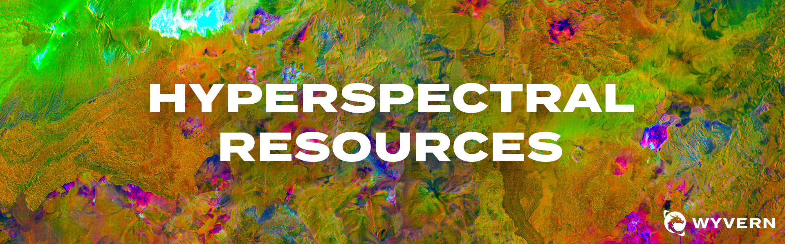

# Wyvern Public Resources

Public repository for tutorials, examples, and useful tools for working with Wyvern Hyperspectral Data.

## Topics

- [🌍 Top of Atmosphere Processing](top-of-atmosphere-processing/README.md): Resources for processing Wyvern HSI data from Top of Atmosphere Radiance to Top of Atmosphere Reflectance
- [Visualizing Wyvern Data](visualizing-wyvern-data/README.md): Resources for visualizing Wyvern imagery & pixel spectra using Python
  - [🖼️ Plotting Wyvern Data](visualizing-wyvern-data/visualizing_wyvern_data.ipynb)
  - [📈 Scatter and Spectral Plots with Wyvern Data](visualizing-wyvern-data/spectra_and_scatter_plots.ipynb)
- [🌈 Relative Spectral Responses](relative-spectral-responses/README.md): Relative Spectral Response (RSR) curves for Wyvern's satellites

# More

Wyvern's [Knowledge Center](knowledge.wyvern.space) is an excellent resource for all things hyperspectral imagery!

Check out our open data program over on [opendata.wyvern.space](https://opendata.wyvern.space/)
