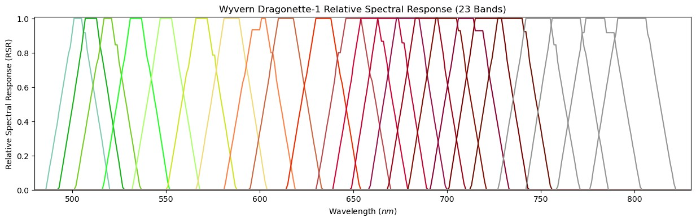

# Relative Spectral Response Curves

This subdirectory holds CSV files containing theoretical relative spectral responses (RSR) for each band
on Wyvern's imagers. Dragonettes 2/3/4+ will have the same RSR curves unless otherwise noted.

Relative spectral response curves depict how sensitive a band on a detector is to different wavelengths
of light. Below is a visualization of the RSR curves for Wyvern's first three satellites:

### Current Files
- `drag_001_rsr_curve.csv`: RSR Curve for Dragonette-001
- `drag_003_rsr_curve.csv`: RSR Curve for Dragonette-003

> [!NOTE]
> Dragonette-002 is still undergoing calibration & validation. It's RSR curve will be released when it is
> ready for commercial operations (soon!)

