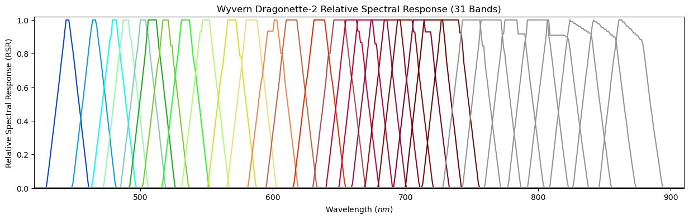

# Relative Spectral Response Curves

This subdirectory holds CSV files containing theoretical relative spectral responses (RSR) for each band
on Wyvern's imagers.

Relative spectral response curves depict how sensitive a band on a detector is to different wavelengths
of light. Below is a visualization of the RSR curves for Wyvern's first three satellites:

### Current Files
- `drag_001_rsr_curve.csv`: RSR Curve for Dragonette-001
- `drag_002_rsr_curve.csv`: RSR Curve for Dragonette-002
- `drag_003_rsr_curve.csv`: RSR Curve for Dragonette-003

